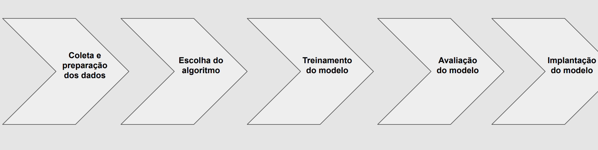

<h1> Machine Learning </h1>                     

<h2> Aprendizado de Máquina (Machine Learning) </h2>
  
 - A habilidade dos computadores aprenderem sem
   serem explicitamente programados;
 - Computadores aprendem de acordo com as
   respostas esperadas por meio de associações de
   diferentes dados (que podem ser imagens,
   números);
 - Algoritmos que podem aprender com seus erros
   e fazer previsões sobre dados a partir de
   diferentes abordagens de aprendizagem;
 - Produz decisões e resultados confiáveis e
   repetíveis.

<h2> Tipos de Aprendizado </h2>

 **Supervisionado:** processo de treinar um modelo para aprender a
 partir de dados rotulados, ou seja, dados que já foram classificados ou
 categorizados previamente. Isso permite que o modelo faça previsões
 sobre novos dados;

 <br>**Não Supervisionado:** processo de treinar um modelo para aprender a
 partir de dados não rotulados. Encontra padrões ou estruturas nos
 dados;

 <br>**Por Reforço:** processo de treinar um modelo para aprender a tomar
 decisões através de recompensas ou punições, que são atribuídas
 com base nas ações do modelo.

<br>

# Etapas
<br>

 **1- Coleta e preparação dos dados:** Coleta dos dados e a preparação deles para serem utilizados no
    treinamento do modelo;

<br>**2- Escolha do algoritmo:** o próximo passo é escolher o algoritmo de aprendizado de máquina que 
    será utilizado para treinar o modelo. Existem vários tipos de algoritmos disponíveis, cada um com suas próprias vantagens e desvantagens;

 <br>**3- Treinamento do modelo:** O modelo é treinado utilizando os dados coletados e preparados na 
    primeira etapa;

 <br>**4- Avaliação do modelo:** Após o treinamento, o modelo é avaliado para determinar sua eficácia 
    e desempenho. Isso ajuda a identificar áreas em que o modelo pode ser melhorado;

 <br>**5- Implantação do modelo:** Por fim, o modelo é implantado em um ambiente de produção e começa a
    tomar decisões ou realizar tarefas de forma autônoma.

<br>

# Aplicações
````
● Reconhecimento de imagens
● Processamento de texto
● Reconhecimento de som
````
<br>

# Link para o Teachable Machine

https://teachablemachine.withgoogle.com/

<br>

#
#
                                                                                        18/04/24

